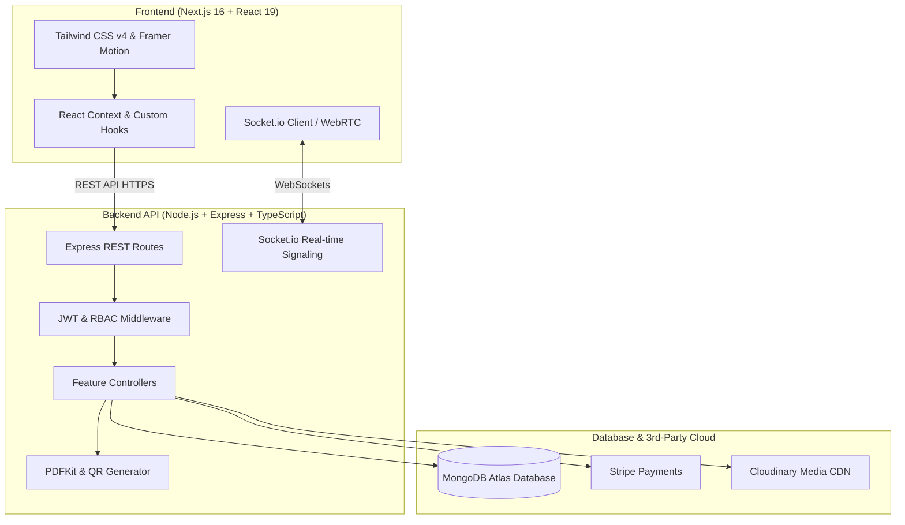

<p align="center">
  
</p>

<h1 align="center">🎓 EduCore — Next-Gen AI-Powered SaaS LMS</h1>

<p align="center">
  <b>A modern, enterprise-grade, full-stack Learning Management System (LMS) designed for schools, universities, creators, and online academies.</b>
</p>

<p align="center">
  <a href="https://edu-core-amber.vercel.app/"></a>
  <a href="https://edu-core-server-ten.vercel.app"></a>
  
  
  
</p>

<p align="center">
  <a href="#-live-demo--endpoints">Live Demo</a> •
  <a href="#-core-features">Features</a> •
  <a href="#-role-based-portals">Role Portals</a> •
  <a href="#-architecture--tech-stack">Tech Stack</a> •
  <a href="#-getting-started">Getting Started</a> •
  <a href="#-api-endpoints">API Docs</a> •
  <a href="#-license">License</a>
</p>

---

## 🌟 Overview

**EduCore** is an all-in-one educational platform that bridges the gap between instructors and students through interactive video learning, real-time live streaming classrooms, automated quiz and assignment pipelines, gamified student motivation, and instant AI tutoring.

Built on the bleeding edge of the web ecosystem with **Next.js 16 (App Router)**, **React 19**, **Tailwind CSS v4**, **Node.js/Express (TypeScript)**, **MongoDB**, and **Socket.io/WebRTC**, EduCore delivers a fast, intuitive, and responsive experience across desktop, tablet, and mobile devices.

---

## 🌐 Live Demo & Endpoints

| Resource | Service | URL | Status |
| :--- | :--- | :--- | :--- |
| **Frontend Application** | Vercel (Next.js 16 + React 19) | [https://edu-core-amber.vercel.app/](https://edu-core-amber.vercel.app/) |  |
| **Backend REST API** | Vercel Serverless / Node.js | [https://edu-core-server-ten.vercel.app](https://edu-core-server-ten.vercel.app) |  |
| **API Health Check** | REST / JSON | [https://edu-core-server-ten.vercel.app/health](https://edu-core-server-ten.vercel.app/health) |  |

---

## 🚀 Key Features & Highlights

```
┌─────────────────────────────────────────────────────────────────────────────┐
│                             EduCore Core Modules                            │
├─────────────────┬──────────────────┬──────────────────┬─────────────────────┤
│ 🎥 Live Classes │ 🤖 AI Companion  │ 🏆 Gamification  │ 📜 Certificate Hub  │
│  WebRTC & Chat  │  Instant Answers │  XP, Badges & LB │  Dynamic PDF & QR   │
├─────────────────┼──────────────────┼──────────────────┼─────────────────────┤
│ 📝 Quiz Engine  │ 📂 Assignments   │ 💳 Stripe Pay    │ 📊 Role Dashboards  │
│  Timed MCQs     │  Submission Hub  │  Instant Access  │  Student/Teach/Admin│
└─────────────────┴──────────────────┴──────────────────┴─────────────────────┘
```

### 🎯 1. Interactive Course Player
- **Adaptive Video Player**: Video playback with playback speed controls, seek intervals, and chapter progression.
- **Curriculum Navigation**: Intuitive sidebar showing completed lessons, upcoming quizzes, and attached resources.
- **Auto-Save Progress**: Real-time progress synchronization per user per course.

### 🔴 2. Real-Time Live Streaming & Virtual Classrooms
- **WebRTC + Socket.io Signaling**: Low-latency video/audio streaming directly in the browser.
- **Live Classroom Chat**: Real-time group discussion and question feeds during lectures.
- **Instant Attendance & Session Recording**: Automated log of attendees and active participants.

### 🤖 3. Intelligent AI Study Assistant
- **Context-Aware Tutoring**: Integrated AI study buddy to explain difficult topics, summarize lessons, and generate practice questions.
- **Instant Homework Help**: Formulates explanations and hints without giving away direct answers.

### 🎮 4. Gamification & Student Engagement
- **XP & Leveling System**: Earn Experience Points (XP) for finishing lessons, acing quizzes, and submitting assignments.
- **Badges & Achievements**: Unlock milestones like *First Step*, *Quiz Master*, *Night Owl*, and *Streak Champion*.
- **Live Leaderboard**: Real-time ranking to foster healthy competition among peers.
- **Learning Streaks**: Daily login & learning streak tracking with celebratory confetti effects.

### 📑 5. Assessments: Quizzes & Assignments
- **Dynamic Quiz Engine**: Timed multi-choice questions (MCQs), instant evaluation, question-by-question explanations, and score cards.
- **Assignment Submissions**: Multi-file attachment submissions, grading rubric, teacher remarks, and resubmission workflows.

### 🎓 6. Verifiable PDF Certificates
- **Instant Generation**: Automatic PDF certificate creation upon 100% course completion.
- **Unique Verification QR Code**: Scan QR code to verify authenticity and issue date on the blockchain/database.

### 💳 7. Seamless Stripe Checkout & Monetization
- **1-Click Checkout**: Direct payment processing with Stripe Checkout session.
- **Automatic Enrollment**: Webhook-triggered instant student enrollment and receipt generation.

---

## 👥 Role-Based Portals

EduCore comes with pre-configured role-based authorization (RBAC):

### 🎓 Student Portal (`/student`)
- Personalized learning dashboard with course progress charts.
- My Enrolled Courses, upcoming assignment deadlines, and quiz scores.
- XP Level, Badges Showcase, and global leaderboard ranking.
- Certificate repository with one-click PDF downloads.

### 👨‍🏫 Instructor / Teacher Studio (`/teacher`)
- Course creation wizard: Add chapters, video lectures, downloadable PDFs, and pricing.
- Interactive Quiz Builder & Assignment Publisher with grading rubrics.
- Live class scheduler & broadcaster.
- Student submission review queue with grading and feedback tools.
- Revenue analytics, enrollment counts, and engagement heatmaps.

### 🛡️ Administrator Hub (`/admin`)
- Platform-wide statistics: Total Gross Volume, Active Users, Course Catalog size.
- User management: Ban/unban users, promote to teacher/admin, manage permissions.
- Course moderation: Review, approve, feature, or remove courses.
- Category & taxonomy customization.

---

## 🏗️ Architecture & Tech Stack



### 💻 Technologies Used:
- **Frontend**: Next.js 16 (App Router), React 19, TypeScript, Tailwind CSS v4, Framer Motion, Lucide React, Recharts, Canvas-Confetti, jsPDF, SweetAlert2.
- **Backend**: Node.js, Express.js, TypeScript, Mongoose (MongoDB ODM), Socket.io, JWT, Bcrypt.js, Multer, Cloudinary, PDFKit, QRCode, Stripe API, Winston Logger.
- **Deployment**: Vercel (Client & Serverless API), MongoDB Atlas.

---

## 📁 Repository Directory Structure

```
edu-core/
├── app/                           # Next.js App Router Pages
│   ├── admin/                     # Admin control center & analytics
│   ├── courses/                   # Course catalog, search & details
│   ├── live/                      # WebRTC live classroom pages
│   ├── login/ & register/         # Authentication & onboarding
│   ├── student/                   # Student dashboard & learn player
│   ├── teacher/                   # Teacher curriculum builder & grading
│   ├── layout.tsx                 # Root layout with providers & navigation
│   └── page.tsx                   # High-converting SaaS landing page
├── components/                    # Modular UI Component Library
│   ├── ai/                        # AI study assistant chat components
│   ├── assignment/                # Assignment player & submission modal
│   ├── charts/                    # Recharts data visualization widgets
│   ├── forum/                     # Course discussions & Q&A feed
│   ├── gamification/              # Badges, streak counter & leaderboard
│   ├── live/                      # WebRTC video room & chat interface
│   ├── quiz/                      # Interactive MCQ player & result cards
│   ├── video/                     # Custom video player & controls
│   ├── Navbar.tsx                 # Responsive header with role navigation
│   └── Footer.tsx                 # Site footer with links
├── context/                       # Global React Contexts (Auth, Cart, UI)
├── hooks/                         # Reusable React hooks
├── lib/                           # Utility functions & API client configs
└── public/                        # Static brand assets & illustrations
```

---

## ⚡ Quick Start & Local Setup

### 📋 Prerequisites
- **Node.js** >= `18.18.0`
- **npm**, **yarn**, or **pnpm**
- Running instance of **EduCore Server** (or use the deployed live server)

### 1️⃣ Installation

```bash
# Clone the repository
git clone https://github.com/your-username/edu-core.git

# Navigate into the frontend folder
cd edu-core

# Install all dependencies
npm install
```

### 2️⃣ Configure Environment Variables

Create a `.env` file in the root of the `edu-core` folder:

```env
# Backend API URL (Local Server)
NEXT_PUBLIC_BACKEND_API=http://localhost:5000/api

# Or use the live cloud backend:
# NEXT_PUBLIC_BACKEND_API=https://edu-core-server-ten.vercel.app/api
```

### 3️⃣ Run Development Server

```bash
npm run dev
```

Visit [http://localhost:3000](http://localhost:3000) in your browser.

---

## 📡 REST API Reference

The application connects to the backend REST API. Below is a summary of primary endpoints:

| Domain | Method | Endpoint | Description | Auth |
| :--- | :---: | :--- | :--- | :---: |
| **Auth** | `POST` | `/api/auth/register` | Register new account | Public |
| **Auth** | `POST` | `/api/auth/login` | Login and obtain JWT token | Public |
| **Auth** | `GET` | `/api/auth/me` | Get logged-in user profile | Bearer |
| **Courses** | `GET` | `/api/courses` | List & filter published courses | Public |
| **Courses** | `GET` | `/api/courses/:id` | Get full course details & curriculum | Public |
| **Courses** | `POST` | `/api/courses` | Create new course | Teacher/Admin |
| **Quizzes** | `GET` | `/api/quizzes/:courseId` | Fetch quizzes for a course | Student |
| **Quizzes** | `POST` | `/api/quizzes/submit` | Submit answers and get instant score | Student |
| **Assignments**| `POST`| `/api/assignments/:id` | Submit homework project file | Student |
| **Live** | `GET` | `/api/live-classes` | List active & upcoming live classes | Authenticated |
| **Payments** | `POST` | `/api/payments/checkout`| Initiate Stripe checkout session | Student |
| **Admin** | `GET` | `/api/admin/overview` | Fetch platform KPIs & metrics | Admin |

---

## 🧪 Build & Quality Verification

```bash
# Lint code for errors
npm run lint

# Build production bundle
npm run build

# Start production server
npm run start
```

---

## 🛡️ Security & Performance Highlights
- 🔒 **Stateless Authentication**: Signed JWT tokens with expiry checks.
- ⚡ **Optimized Rendering**: Next.js Server & Client Component separation for fast page loads.
- 🎨 **Modern Design System**: Built with Tailwind CSS v4 variables and responsive breakpoints.
- 📱 **Mobile First**: 100% responsive on phones, tablets, and wide screens.

---

## 📄 License
This project is open-source and available under the [MIT License](LICENSE).

---

<p align="center">
  Crafted with ❤️ for the future of education with <b>EduCore</b>.
</p>
